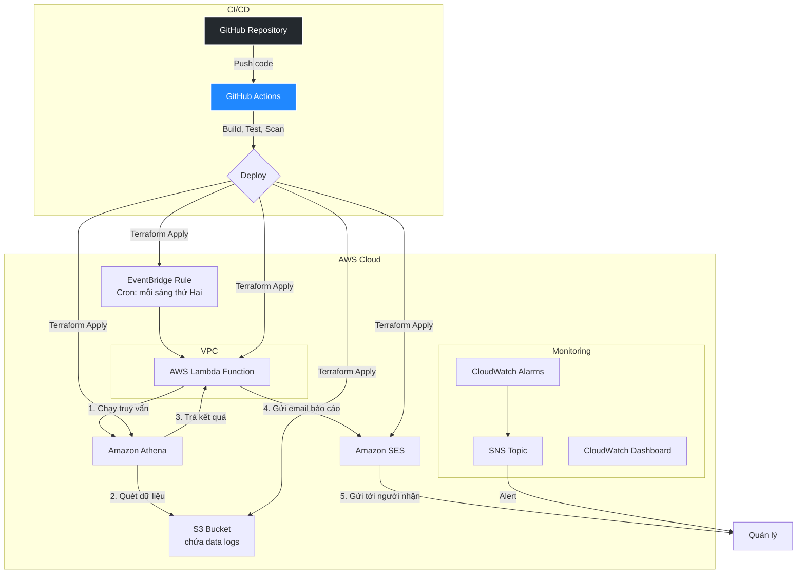

# Data Analytics Report System

Hệ thống tự động phân tích dữ liệu và gửi báo cáo định kỳ sử dụng AWS serverless architecture.

## 🏗️ Kiến trúc hệ thống



## ✨ Tính năng chính

- **Tự động hóa hoàn toàn**: Chạy theo lịch mỗi sáng thứ Hai
- **Phân tích dữ liệu**: Sử dụng Amazon Athena để truy vấn dữ liệu từ S3
- **Báo cáo email**: Gửi báo cáo HTML/text qua Amazon SES
- **Bảo mật**: VPC, IAM roles với least privilege, mã hóa S3
- **Giám sát**: CloudWatch alarms, SNS notifications, dashboard
- **CI/CD**: GitHub Actions với security scanning và multi-environment

## 🚀 Triển khai nhanh

### Yêu cầu hệ thống

- [AWS CLI](https://docs.aws.amazon.com/cli/latest/userguide/getting-started-install.html) đã cấu hình
- [Terraform](https://learn.hashicorp.com/tutorials/terraform/install-cli) >= 1.5.0
- [Python](https://www.python.org/downloads/) >= 3.9
- [Make](https://www.gnu.org/software/make/) (thường có sẵn trên macOS/Linux)
- Git

### Bước 1: Cấu hình ban đầu

```bash
# Clone repository
git clone <repository-url>
cd sun-devops-mock-04

# Chạy setup (tạo S3 bucket, env file, install dependencies)
make setup

# Load environment variables
source .env
```

### Bước 2: Cấu hình email

Cập nhật email addresses trong:
```bash
# Development
vi infra/environments/dev/terraform.tfvars

# Production  
vi infra/environments/prod/terraform.tfvars
```

Thay đổi:
```hcl
notification_emails = ["your-email@example.com"]
```

### Bước 3: Triển khai

```bash
# Deploy to development
make deploy ENV=dev

# Deploy to production (optional)
make deploy ENV=prod

# Or use shorthand commands
make dev-deploy    # Same as make deploy ENV=dev
make prod-deploy   # Same as make deploy ENV=prod
```

### Bước 4: Xác thực email trong AWS SES

1. Đăng nhập AWS Console
2. Mở Amazon SES service
3. Vào "Verified identities"
4. Xác thực các email addresses đã cấu hình

## 📁 Cấu trúc dự án

```
.
├── README.md
├── .github/
│   └── workflows/
│       └── deploy.yml           # GitHub Actions CI/CD
├── infra/                       # Infrastructure as Code
│   ├── main.tf                  # Main Terraform configuration
│   ├── variables.tf             # Input variables
│   ├── outputs.tf               # Output values
│   ├── modules/                 # Terraform modules
│   │   ├── vpc/                 # VPC and networking
│   │   ├── lambda/              # Lambda function
│   │   ├── s3/                  # S3 buckets
│   │   ├── athena/              # Athena database and queries
│   │   ├── eventbridge/         # EventBridge rules
│   │   ├── ses/                 # SES email service
│   │   └── monitoring/          # CloudWatch monitoring
│   └── environments/            # Environment-specific configs
│       ├── dev/
│       └── prod/
├── src/
│   ├── lambda/
│   │   └── data_analyzer/       # Lambda function code
│   │       ├── handler.py       # Main Lambda handler
│   │       └── requirements.txt # Python dependencies
│   └── sample_data/             # Sample JSON data files
├── Makefile                     # Main automation commands
├── MAKEFILE_USAGE.md           # Makefile documentation
└── .env                         # Environment variables (generated)
```

## 🔧 Lựa chọn thiết kế

### 1. **Infrastructure as Code (Terraform)**
- **Tại sao**: Declarative, version control, reproducible infrastructure
- **Modules**: Tách biệt concerns, tái sử dụng, dễ bảo trì

### 2. **Serverless Architecture**
- **Lambda**: Cost-effective, auto-scaling, no server management
- **EventBridge**: Reliable scheduling, event-driven architecture
- **Athena**: Pay-per-query, no infrastructure to manage

### 3. **Security First**
- **VPC**: Network isolation cho Lambda
- **IAM Least Privilege**: Chỉ cấp quyền cần thiết
- **S3 Encryption**: Mã hóa dữ liệu at rest
- **Private Subnets**: Các services nhạy cảm trong private network

### 4. **Monitoring & Observability**
- **CloudWatch Alarms**: Phát hiện lỗi và performance issues
- **SNS Notifications**: Alert real-time
- **Dashboard**: Visualization metrics

## 🔐 Bảo mật

### Network Security
- Lambda chạy trong private subnets
- NAT Gateway cho internet access
- VPC Endpoints cho S3 (giảm cost + tăng security)

### Identity & Access Management
- Lambda role chỉ có quyền cần thiết:
  - Athena: StartQuery, GetResults
  - S3: Read data bucket, Read/Write results bucket  
  - SES: SendEmail
  - CloudWatch: Logs

### Data Security
- S3 buckets:
  - Server-side encryption (AES256)
  - Block public access
  - Versioning enabled
  - Lifecycle policies

## 📊 Giám sát

### CloudWatch Alarms
- **Lambda Errors**: Alert khi có lỗi
- **Lambda Duration**: Alert khi execution time cao
- **Lambda Throttles**: Alert khi bị throttle

### Metrics
- Lambda invocations, errors, duration
- Athena query execution time
- S3 bucket size and requests

### Dashboard
- Real-time Lambda metrics
- Recent log entries
- System health overview

## 🔄 CI/CD Pipeline

### GitHub Actions Workflow
1. **Security Scan**: Trivy vulnerability scanner
2. **Code Quality**: 
   - Terraform format/validate
   - Python linting (Black, Flake8, Pylint)
   - Unit tests
3. **Multi-Environment Deployment**:
   - Plan on PRs
   - Auto-deploy to dev on main branch
   - Manual approval for production

### Pipeline Features
- Parallel job execution
- Security scanning with SARIF upload
- Terraform state management
- Lambda packaging and deployment
- Output summaries

## � Automation với Makefile

Project này sử dụng **Makefile** để tự động hóa các tác vụ phát triển và triển khai:

```bash
# Xem tất cả commands có sẵn
make help

# Các commands phổ biến
make setup          # Setup ban đầu
make dev-deploy     # Deploy to development  
make prod-deploy    # Deploy to production
make dev-destroy    # Cleanup development
make status         # Xem trạng thái hiện tại
make logs ENV=dev   # Xem logs
```

📖 **Xem thêm**: [MAKEFILE_USAGE.md](MAKEFILE_USAGE.md) để biết chi tiết về tất cả commands.

## 📝 Cách sử dụng

### Thủ công trigger Lambda
```bash
make invoke-lambda ENV=dev
# Or manually with AWS CLI:
aws lambda invoke \
  --function-name data-analytics-report-dev-data-analyzer \
  --payload '{"source":"manual","report_type":"weekly"}' \
  response.json
```

### Xem logs
```bash
make logs ENV=dev
# Or manually:
aws logs tail /aws/lambda/data-analytics-report-dev-data-analyzer --follow
```

### Test Athena query
```bash
aws athena start-query-execution \
  --query-string "SELECT * FROM sales_data LIMIT 10" \
  --query-execution-context Database=data_analytics_report_dev \
  --work-group data-analytics-report-dev-workgroup
```

### Các lệnh Makefile hữu ích
```bash
make help              # Xem tất cả commands có sẵn
make status            # Kiểm tra trạng thái hiện tại
make plan ENV=dev      # Xem Terraform plan
make output ENV=dev    # Xem Terraform outputs
make clean             # Dọn dẹp temporary files
make lint              # Check code quality
make format            # Format Python code
make test              # Chạy unit tests
```

## 🔧 Customization

### Thay đổi schedule
Trong `infra/environments/*/terraform.tfvars`:
```hcl
# Mỗi ngày 9:00 AM
schedule_expression = "cron(0 9 * * ? *)"

# Mỗi thứ 6 6:00 PM  
schedule_expression = "cron(0 18 ? * FRI *)"
```

### Thêm metrics mới
Cập nhật query trong `infra/modules/athena/main.tf`:
```sql
SELECT 
  store_location,
  product_category,  -- Thêm field mới
  COUNT(*) as total_transactions,
  SUM(total_amount) as total_revenue
FROM sales_data 
WHERE transaction_date >= date_add('day', -7, current_date)
GROUP BY store_location, product_category
```

### Custom email template
Chỉnh sửa `generate_html_report()` trong `src/lambda/data_analyzer/handler.py`

## 🚨 Troubleshooting

### Common Issues

**1. Email không được gửi**
- Kiểm tra SES verified identities
- Xem Lambda logs để tìm lỗi SES
- Đảm bảo email đúng format

**2. Athena query failed**
- Kiểm tra S3 data format
- Xác thực table schema
- Xem query execution details trong Athena console

**3. Lambda timeout**
- Tăng timeout trong terraform variables
- Tối ưu query performance
- Kiểm tra VPC configuration

**4. Terraform deployment failed**
- Kiểm tra AWS credentials và permissions
- Xác thực S3 backend bucket exists
- Review terraform plan trước khi apply

### Debug Commands
```bash
# Check terraform state
terraform show

# View Lambda function configuration  
aws lambda get-function --function-name <function-name>

# List S3 bucket contents
aws s3 ls s3://<bucket-name> --recursive

# Check SES identities
aws ses list-verified-email-addresses
```


